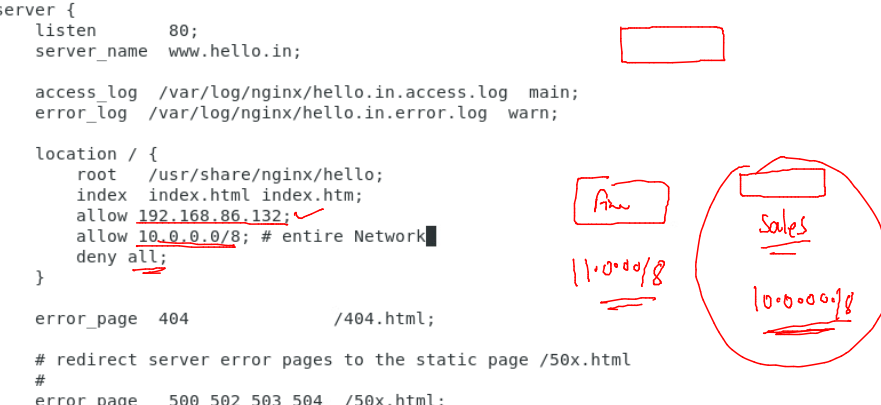
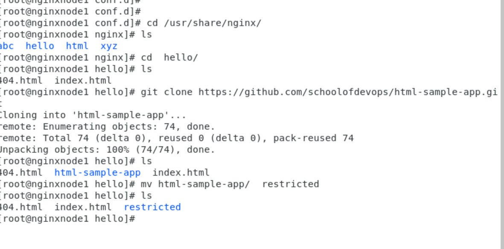
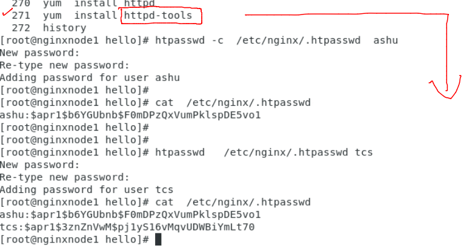
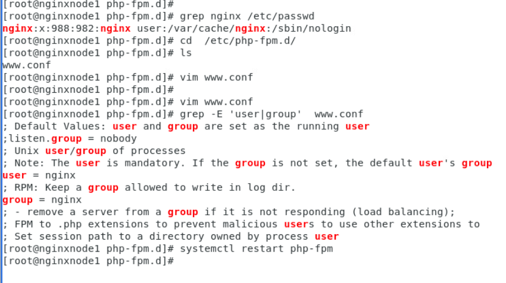
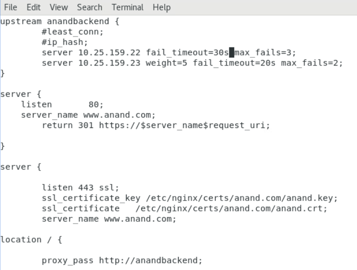
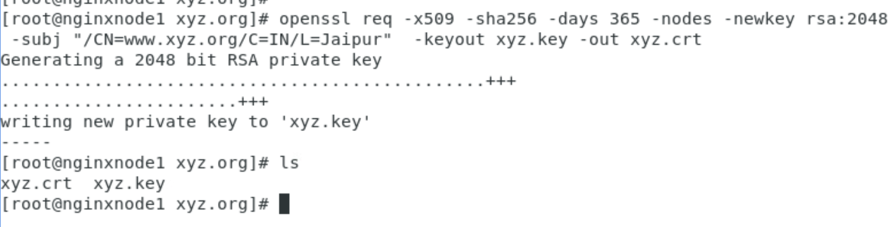
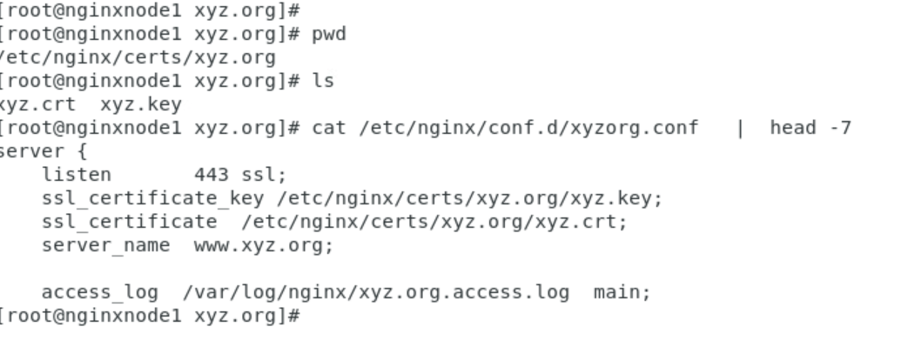

## Nginx admin training 

### REvision 


### Network based access control of any application/ website 



### http authentication in nginx 


### taking sample code from github 



### generating http auth and password for webpage security 



### updating conf file 



### http to https -- journey 

### importance of SSL Certificate 



### generating self sign ssl certificate 



### configure 



### 

````
nginx -t
nginx -s reload 
```
