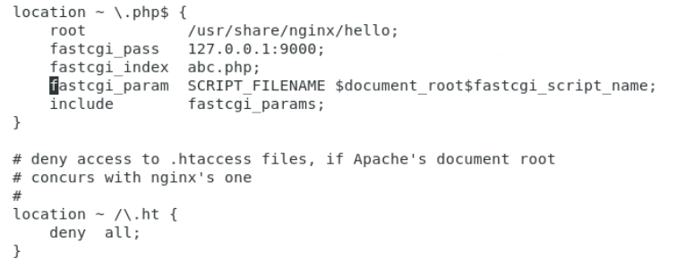
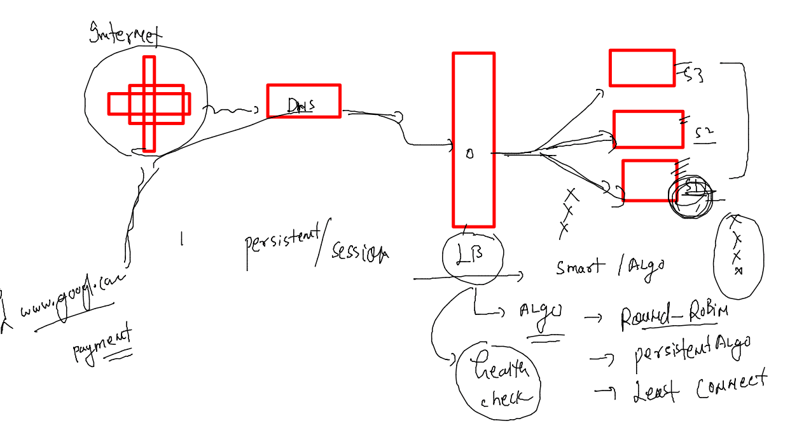
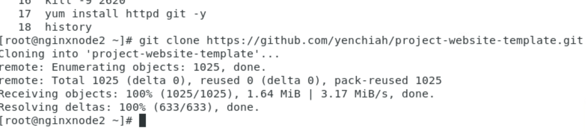
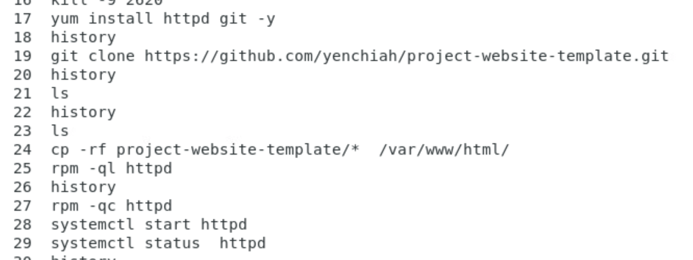
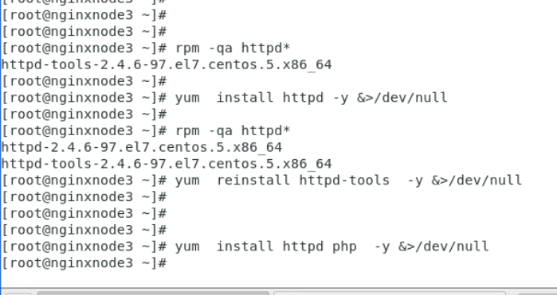

## Nginx admin training 

### Revision 

### installing php-fpm 

### configure FPM for nginx 

### php conf in helloin.conf 

## LoadBalancer --

### Nginx as LoadBalancer 

## Lets configure VM2 & vm3 as apache httpd server where our actual application is running 

### Install httpd and host sample app 

### vm 2 job done 

### vm3 job done 

