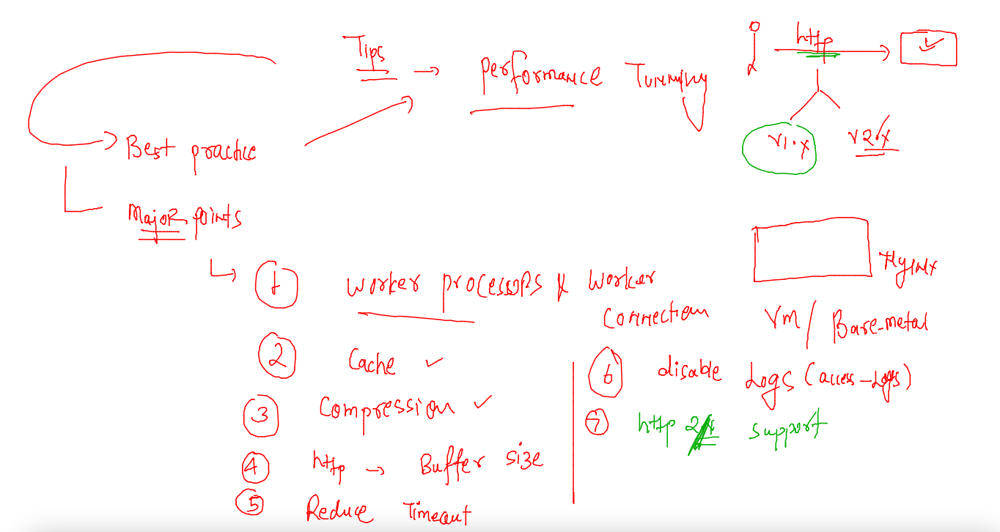
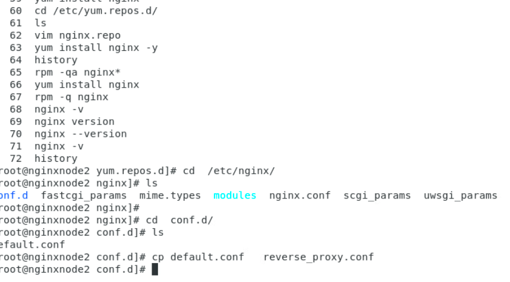
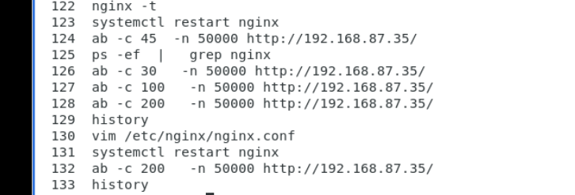

## Nginx admin training 

## nginx as cache usages -- CDN 

### configure nginx master and nginx worker to use cache directory 

## Now we are getting started with Performance tunning in nginx 

### On vm 3 -- installing nginx and ab 

### using ab command to test http request 

