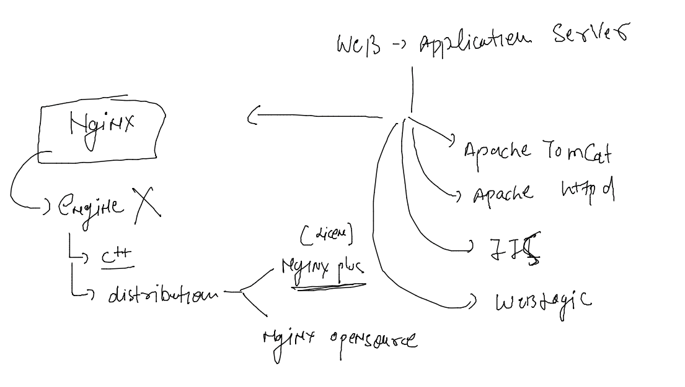
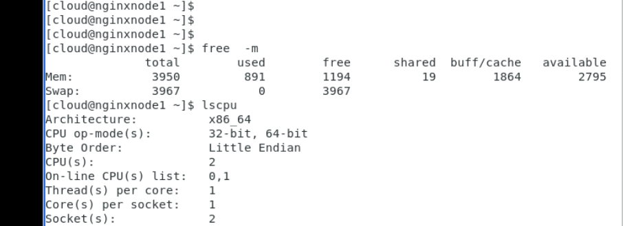
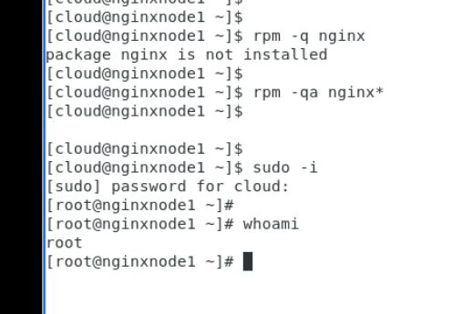
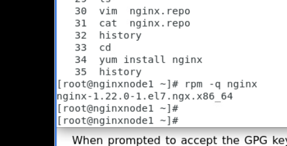

## Nginx admin training 

### info about Nginx 

## Installation of nginx opensource server 

### checking ram and CPU 

### checking nginx installation status 

### adding nginx official repo 

### install and verify 

