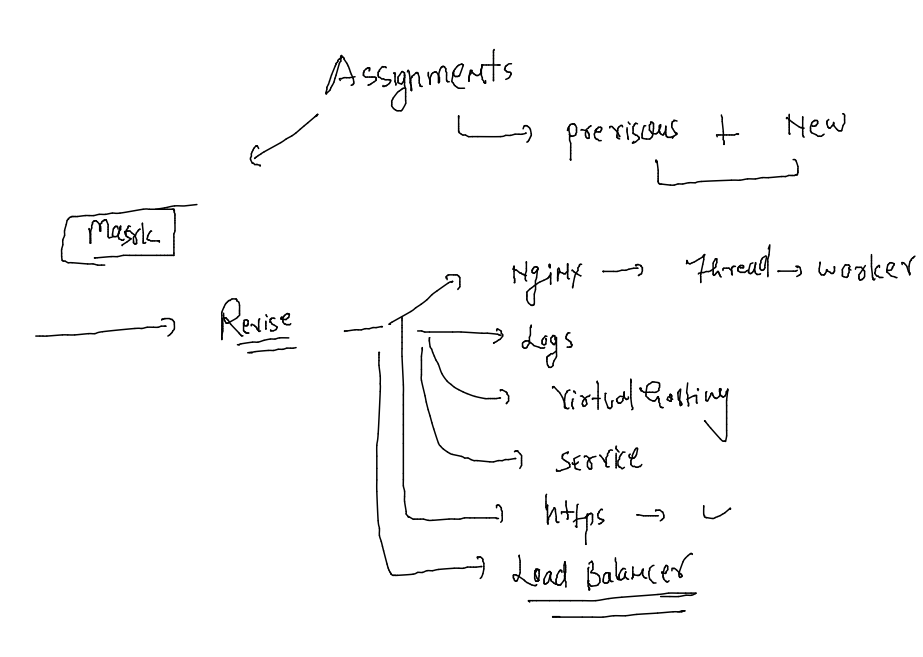
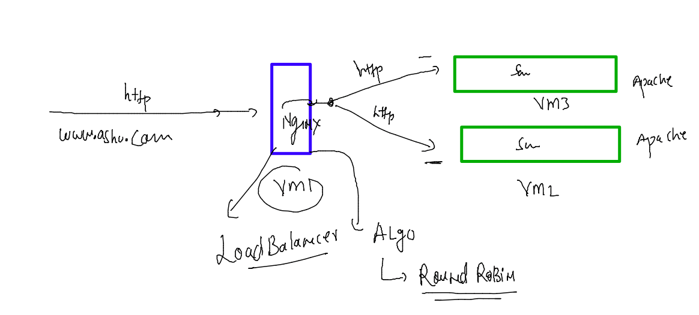
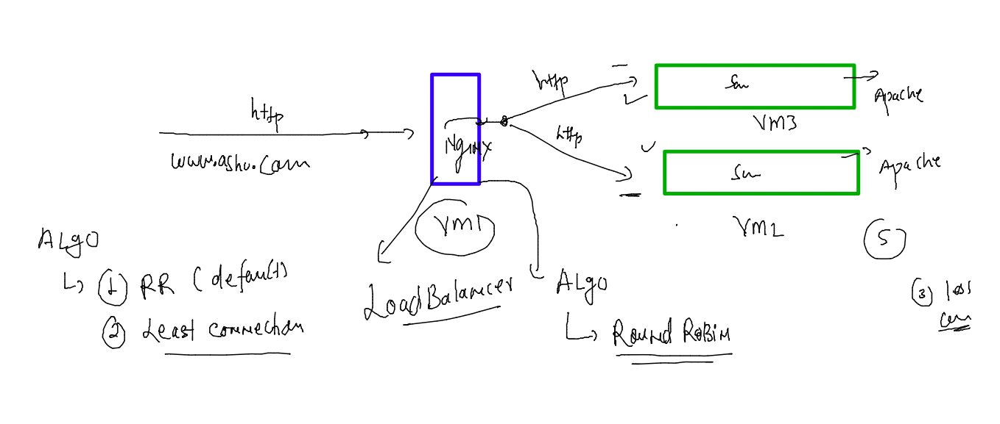
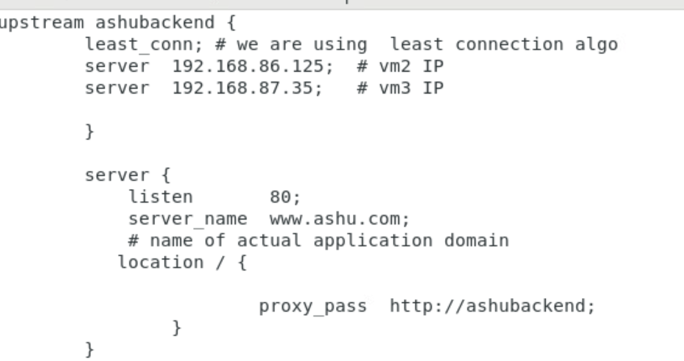
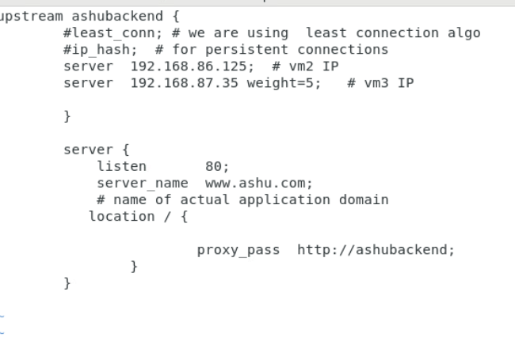
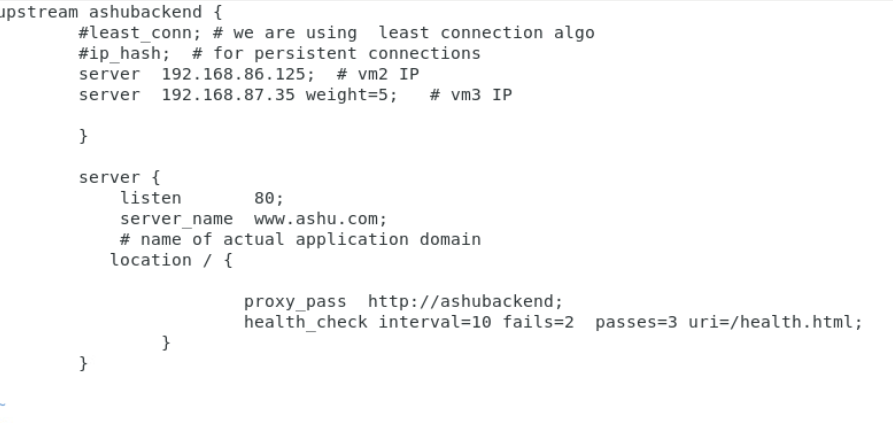
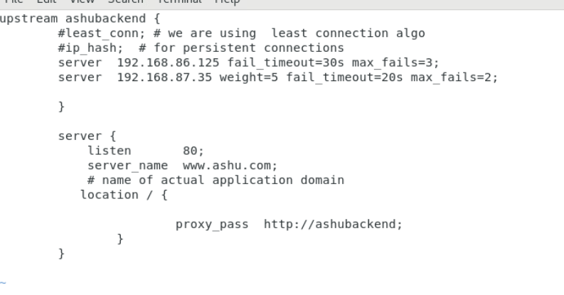
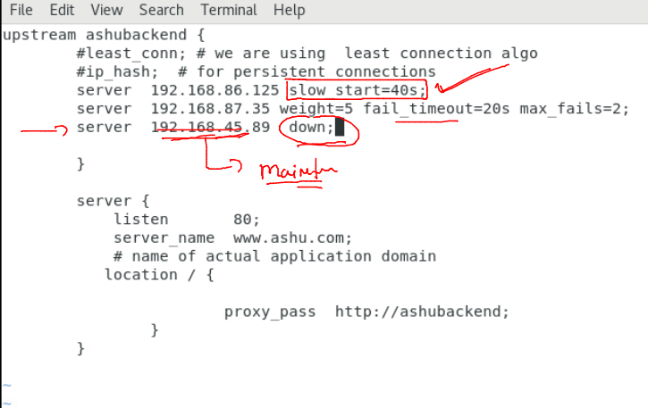

## Nginx admin training 

### Recalling of Nginx 

### Load Balancer with Nginx 

### Understanding nginx as Load Balancer algo -- 

### configure least-conn

### weight 

### LB health check configure  ### this is not working as of now

### going with another option 

### more health check options 

