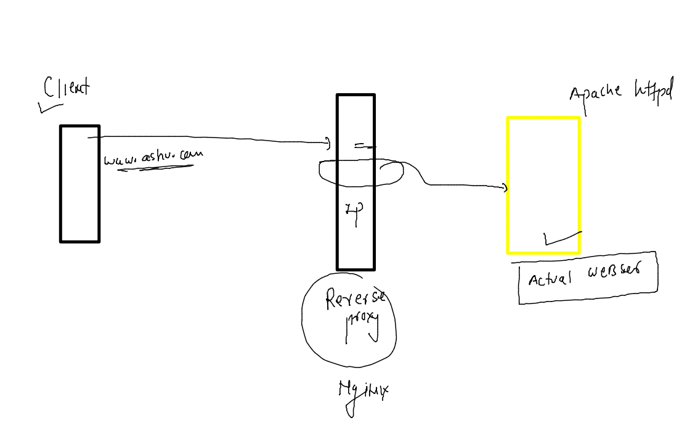
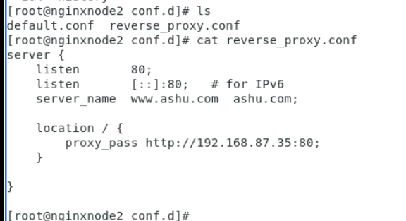
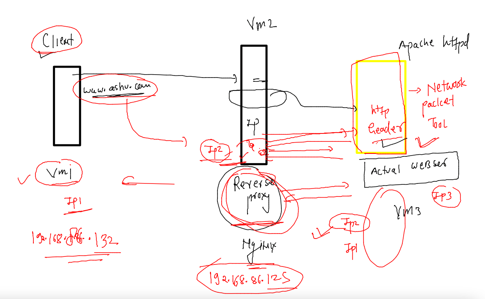
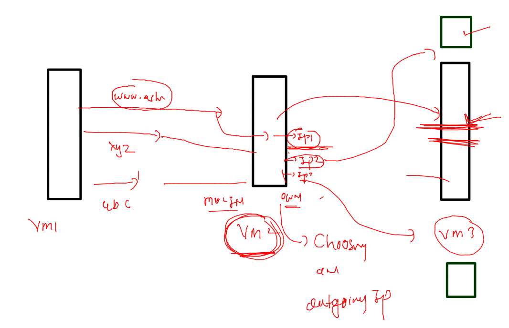
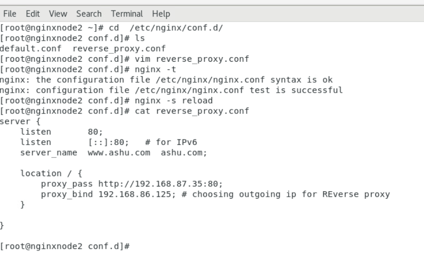

## Nginx admin training 

### Revision of Nginx based reverse proxy 

### vm 2 reverse proxy setup 

### client - Reverse proxy -- actual server 

### choosing an outgoing IP address -- Reverse proxy to orginal server 

### config snap 

