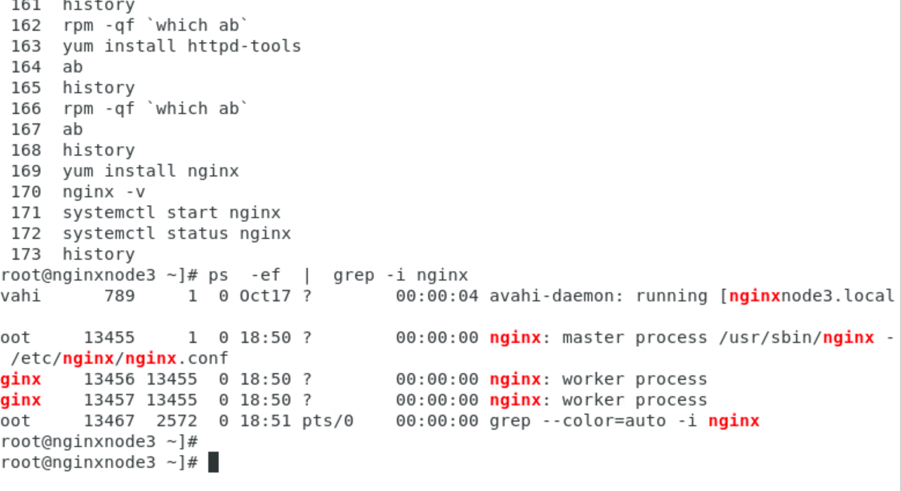

## Nginx admin training 

### LOadBalancer with SSL request 

### proxy concept in nginx 

### REverse proxy as Nginx & nginx plus 

### REverse proxy lab setup 

### Installing httpd with php in VM3 this will act as web server 

### hosted html and php based sample code on vm3 

### Installing nginx in VM 2

### COnfigure nginx reverse proxy configuration 

### starting nginx with selinux disabled 

