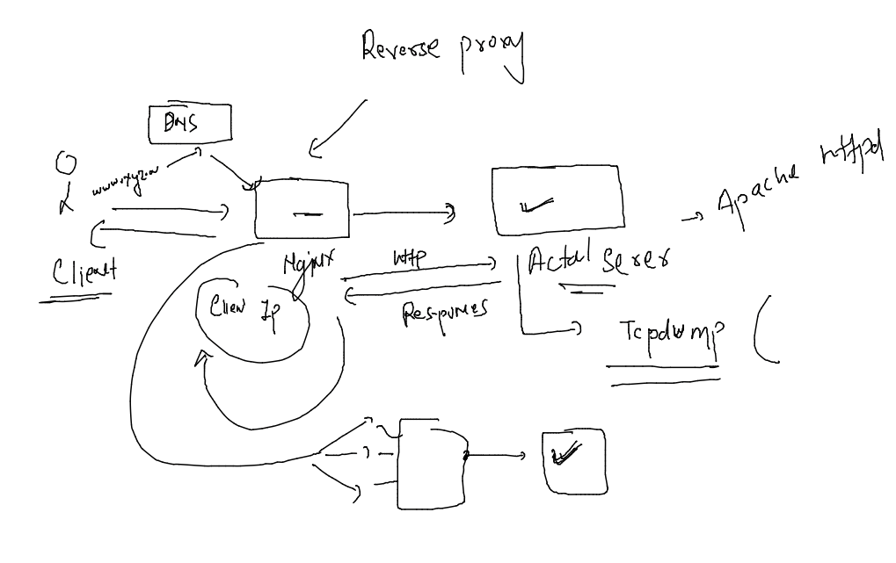
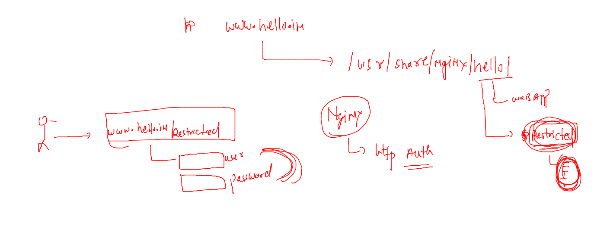

## Nginx admin training 

### REvision 



### Network based access control of any application/ website 


### http authentication in nginx 



### taking sample code from github 


### generating http auth and password for webpage security 


### updating conf file 


### http to https -- journey 

### importance of SSL Certificate 


### generating self sign ssl certificate 


### configure 


### 

````
nginx -t
nginx -s reload 
```
