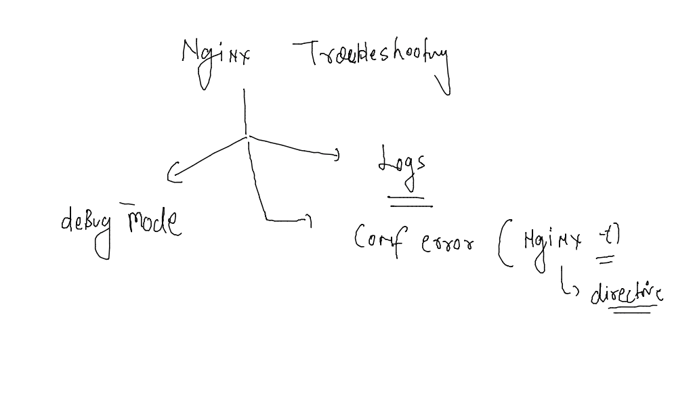

## Nginx admin training 

### Understanding compression at Nginx level and supported MIME types 

### all supported mime.types in nginx 

### default mime.type compression support in Nginx 

### nginx adding mime.type support 

### More about compression 

## Understanding cache 

### Default location and directory by nginx 

### lets configure cache in /etc/nginx/nginx.conf 

### putting cache time limit with response code of http proto 

