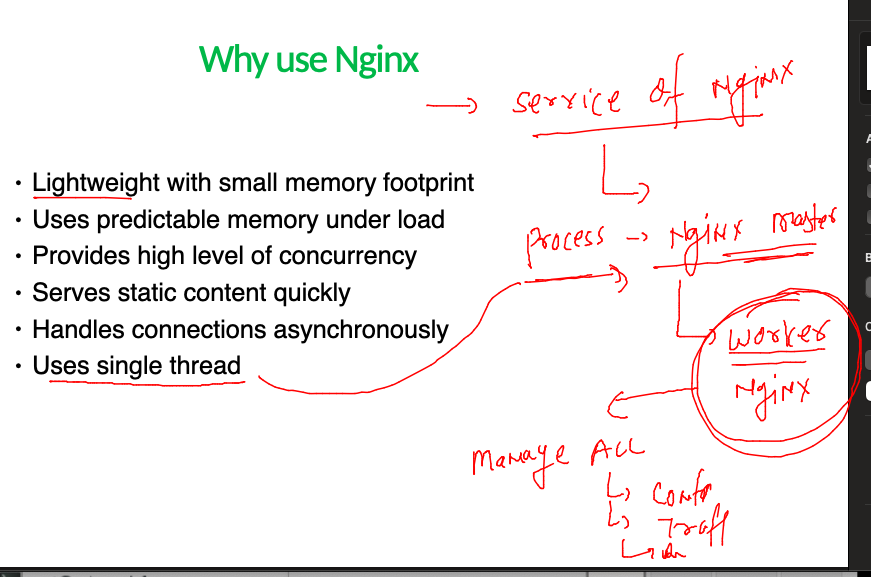

## Nginx admin training 

### checking nginx installation and related info 

### few more info about nginx post  installation 

### checking all info in nginx 

### Nginx master and worker process 

### checking master and worker process 

### VirtualHosting in nginx 

## Need of Vhost to setup in nginx 

### Directory Distribution 

### creating directory structure 

### creating configuration for different apps 

### configure abc.com as first website 

### testing configuration 

### after making changes in nginx configure --not to use systemctl restart nginx 

### updating abc page 

### configure error logs 

###  Summary 

