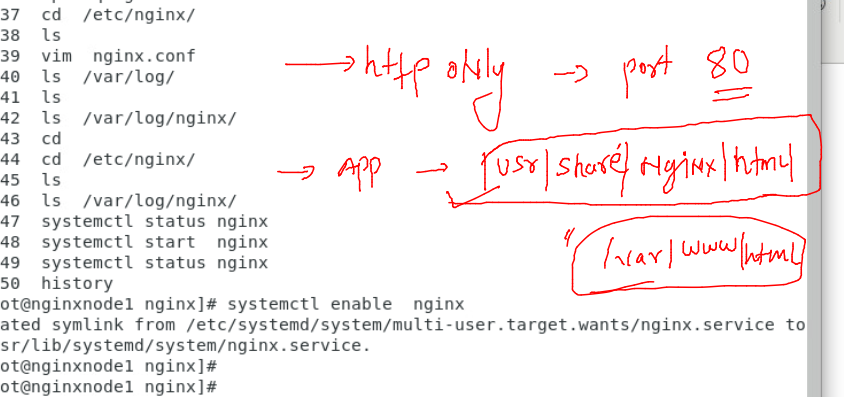

## Nginx admin training 

### info about Nginx 

## Installation of nginx opensource server 

### checking ram and CPU 

### checking nginx installation status 

### adding nginx official repo 

### install and verify 

### nginx configuration details 

### starting nginx service 

### default http port and document location 

### access default app

### summary 

